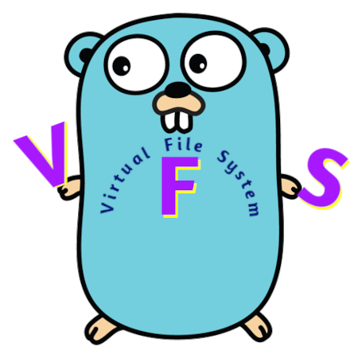

# VFS for GoLang


[](https://goreportcard.com/report/github.com/lordofscripts/vfs)
[](https://coveralls.io/github/lordofscripts/vfs?branch=main)




`vfs` is GO library to support *Virtual Filesystems*. It provides the basic
abstractions of filesystems and implementations, like:

* `OS` accessing the file system of the underlying OS,
* `memfs` a full filesystem in-memory, and
* `dummy` which does nothing other than outputting what file operation was
  called without actually modifiying the underlying file system.

## Usage

```bash
$ go get github.com/lordofscripts/vfs
```
Note: Always vendor your dependencies or fix on a specific version tag.

```go
import github.com/lordofscripts/vfs
```


```go
// Create a vfs accessing the filesystem of the underlying OS
var osfs vfs.Filesystem = vfs.OS()
osfs.Mkdir("/tmp", 0777)

// Make the filesystem read-only:
osfs = vfs.ReadOnly(osfs) // Simply wrap filesystems to change its behaviour

// os.O_CREATE will fail and return vfs.ErrReadOnly
// os.O_RDWR is supported but Write(..) on the file is disabled
f, _ := osfs.OpenFile("/tmp/example.txt", os.O_RDWR, 0)

// Return vfs.ErrReadOnly
_, err := f.Write([]byte("Write on readonly fs?"))
if err != nil {
    fmt.Errorf("Filesystem is read only!\n")
}
```


```go
// Create a fully writable filesystem in memory
mfs := memfs.Create()
mfs.Mkdir("/root", 0777)

// Create a vfs supporting mounts
// The root fs is accessing the filesystem of the underlying OS
fs := mountfs.Create(osfs)

// Mount a memfs inside /memfs
// /memfs may not exist
fs.Mount(mfs, "/memfs")

// This will create /testdir inside the memfs
fs.Mkdir("/memfs/testdir", 0777)

// This would create /tmp/testdir inside your OS fs
// But the rootfs `osfs` is read-only
fs.Mkdir("/tmp/testdir", 0777)
```


```go
// Now use a BitBucket Filesystem in Silent mode
fsb1 := bucketfs.Create()
fsb1.Mkdir("/bucket/testdir", 0777))

// Or an extended BitBucket Filesystem
ErrCustom := errors.New("A BitBucket error"))
fsb2 := bucketfs.CreateWithError(ErrCustom).
         WithFakeDirs([]string{"/bucket/Dir1", "/bucket/Dir2"}).
         WithFakeFiles([]string{"/bucket/Dir1/test.doc", "/bucket/Dir2/test.pdf"})
entries, err := fsb2.ReadDir("/bucket")
```

Check detailed examples below. Also check the [GoDocs](http://godoc.org/github.com/lordofscripts/vfs).

## Why should I use this lib?

- Pure unadulterated GO
- (Nearly) Fully tested
- Easy to create your own filesystem
- Mock a full filesystem for testing (or use included `memfs` or `bucketfs`)
- Compose/Wrap Filesystems `ReadOnly(OS())` and write simple Wrappers
- Flexible BitBucket filesystem

## Features and Examples

Many features, see [GoDocs](http://godoc.org/github.com/lordofscripts/vfs) and examples below

- [OS Filesystem support](http://godoc.org/github.com/lordofscripts/vfs#example-OsFS)
- [ReadOnly Wrapper](http://godoc.org/github.com/lordofscripts/vfs#example-RoFS)
- [DummyFS for quick mocking](http://godoc.org/github.com/lordofscripts/vfs#example-DummyFS)
- [MemFS - full in-memory filesystem](http://godoc.org/github.com/lordofscripts/vfs/memfs#example-MemFS)
- [MountFS - support mounts across filesystems](http://godoc.org/github.com/lordofscripts/vfs/mountfs#example-MountFS)

### Current state: RELEASE

While the functionality is quite stable and heavily tested, interfaces are subject to change.

    You need more/less abstraction? Let me know by creating a Issue, thank you.

### Motivation

The original author [Benedikt Lang](https://github.com/blang) wrote:

> I simply couldn't find any lib supporting this wide range of variation and adaptability.

And I (*LordOfScripts*) share his thoughts. In fact, I evaluated several similar
GO libraries but many were too bloated and included other appendages I was not
interested in. I loved this VFS version because it had no other dependencies.


## What's Different (History)?

The original GO-VFS repository was `github.com/blang/vfs` by
[Benedikt Lang)](https://github.com/blang/vfs). Which stopped at **v1.0.0** about
nine (9) years ago. It was a quite mature implementation which I was actually
using in one of my projects. But it came short in emulating a Dry Run. I ended
up writing my own quick & grey [Dry Run](https://github.com/lordofscripts/wipechromium/blob/main/file_ops.go)
for that purpose, and it worked quite well.

Since I was still using `blang/vfs` in the Unit Tests (only), I figured I might
as well invest some time and integrate it fully to replace my Dry Run as a
mere exercise. I started looking for better-fitting alternatives. There were none,
but there were about 50+ forks of the original `blang/vfs` but all where just
abandoned forks with no extra commits (people's fake trophies?). In that long list
I came across the single fork that had actually extra commits and extra
functionality.

So, I discovered 3JoB's fork tagged wrongly `v1.0.0` when it should have been
`v1.1.0` because it built on the original with added functionality:

* Support for Symbolic Links
* Support for Walk function
* Minor changes like using `any` instead of `interface{}`

But [3JoB/vfs](https://github.com/3JoB/vfs)'s version didn't quite meet my requirements.
While the original version dated from 9 years ago, 3JoB's last commit was a year
ago, but it seemed to have ended there too. I decided to fork that and enhance it:

Is this a YAUF (Yet-Another-Useless-Fork)? well, no! I plan on making certain
enhancements that would make it suitable for my application out-of-the-box
without the need for glue structures. So, Keep tuned! But to start with:

* Updated it to use `main` as branch instead of the deprecated `master`
* Added `go.mod`
* Included a GO workflow for building.
* Has a flexible BitBucket Filesystem `bucketfs` more suitable for testing
* Bumped version to `v1.2.0` to properly reflect new functionality beyond
  Benedikt's & 3JoB's.

In due time more changes will come.

### License

See [LICENSE](LICENSE) file.
